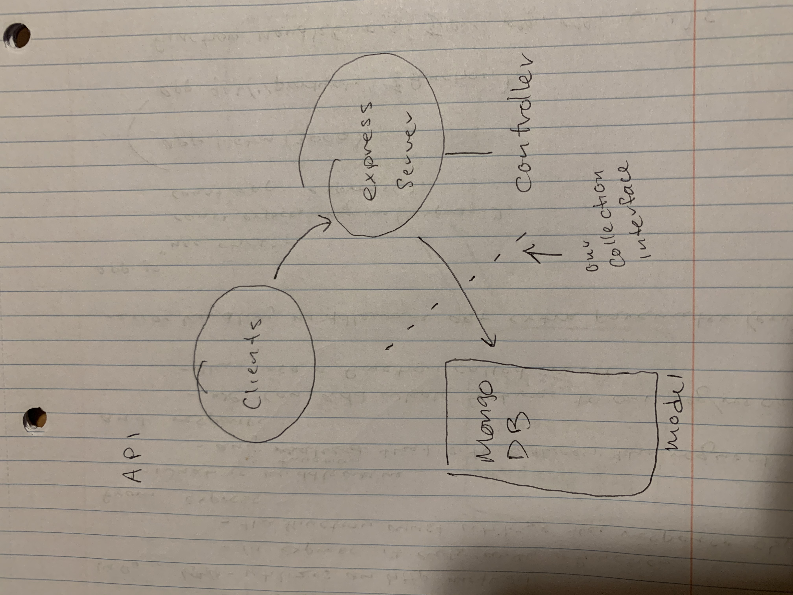

# LAB - 08 API- Server
## Author: Sara Russert

## Description of Project
A server for API's stored in a noSQL DB

## Installing API Server
git clone https://github.com/401-advanced-javascript-sararussert/api-server.git

then NPM I

## Using API Server
to run server - npm start
to test - npm test

## Resources and Links
https://app.swaggerhub.com/apis/SaraRussert/API_Server/0.1

## Acknowledgments
Worked with kevin, michael, and spencer

UML

